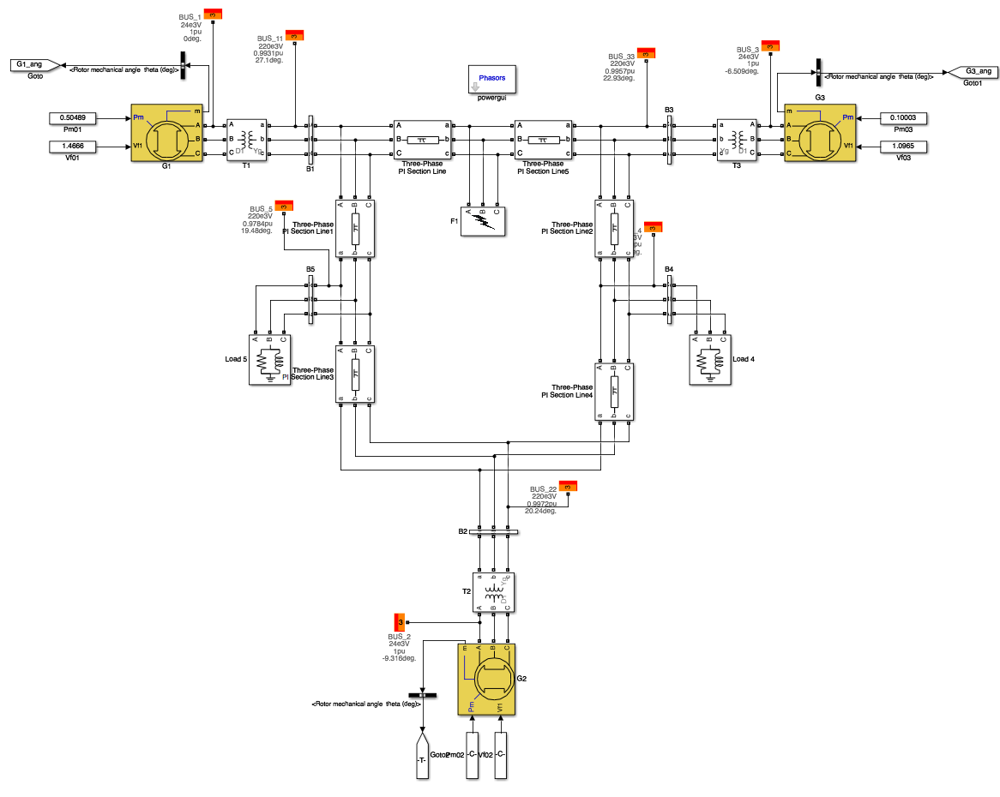

Three-Machine Power System Model
================================

The machine-learning algorithms will be provided with the data generated from the dynamic simulation of the three-machine power system model. The model was built in Matlab/Simulink environment.
Its structure is shown in Fig. 1.

   Figure 1: The Three-Machine Power System Model

Power Flow Data
---------------
The base case data for the power flow calculations is shown in the following code snippet. The calculations can be run directly using a power flow solver provided with Simulink or by using `MATPOWER
<https://github.com/MATPOWER/matpower>`_.

.. highlight:: matlab
::

      %   Power flow data for Three-Machine System
      mpc.version = '2';
      mpc.baseMVA = 100;

      %% =====Bus Data=====

      %	          bus_i	type Pd	Qd	Gs	Bs	area	Vm	Va	baseKV	zone	Vmax	Vmin
      mpc.bus = [
                  1 	3	0	0	0	0	1	1	0	220	1	1.1	0.9;
                  2 	2	0	0	0	0	1	1	0	220	1	1.1	0.9;
                  3 	2	0	0	0	0	1	1	0	220	1	1.1	0.9;
                  4 	1	10	1	0	0	1	1	0	220	1	1.1	0.9;
                  5 	1	70	7	0	0	1	1	0	220	1	1.1	0.9;
      ];

      %% =====Generator Data=====

      %	bus	Pg	Qg	Qmax	Qmin	Vg	mBase	status	Pmax	Pmin	Pc1	Pc2	Qc1min	Qc1max	Qc2min	Qc2max	ramp_agc	ramp_10	ramp_30	ramp_q	apf
      mpc.gen = [
          1	0	0	300	-300	1	100	1	250	0	0	0	0	0	0	0	0	0	0	0	0;
          2	20	0	300	-300	1	100	1	270	0	0	0	0	0	0	0	0	0	0	0	0;
          3	20	0	300	-300	1	100	1	270	0	0	0	0	0	0	0	0	0	0	0	0;
      ];

      %% =====Branch Data=====
      %	fbus	tbus	r	x	b	rateA	rateB	rateC	ratio	angle	status	angmin	angmax
      mpc.branch = [
          1	4	0	0.1	0	250	250	250	0	0	1	-360	360;
          2	4	0	0.2	0	250	250	250	0	0	1	-360	360;
          3	5	0	0.3	0	250	250	250	0	0	1	-360	360;
          4	5	0	0.5	0	250	250	250	0	0	1	-360	360;
      ];

Data Set Generation
-------------------

Data set was generated by successive variations of operating conditions of a generator G2 (active and reactive powers) and estimations of a critical clearing time for a fault in the middle of the line between buses B1 and B3.
The processed data set is provided in the form of Comma-Separated Values file (*.csv) and can be found in the `repository <https://github.com/tinrabuzin/EH2745-CAPS/tree/master/src/datasets>`_.